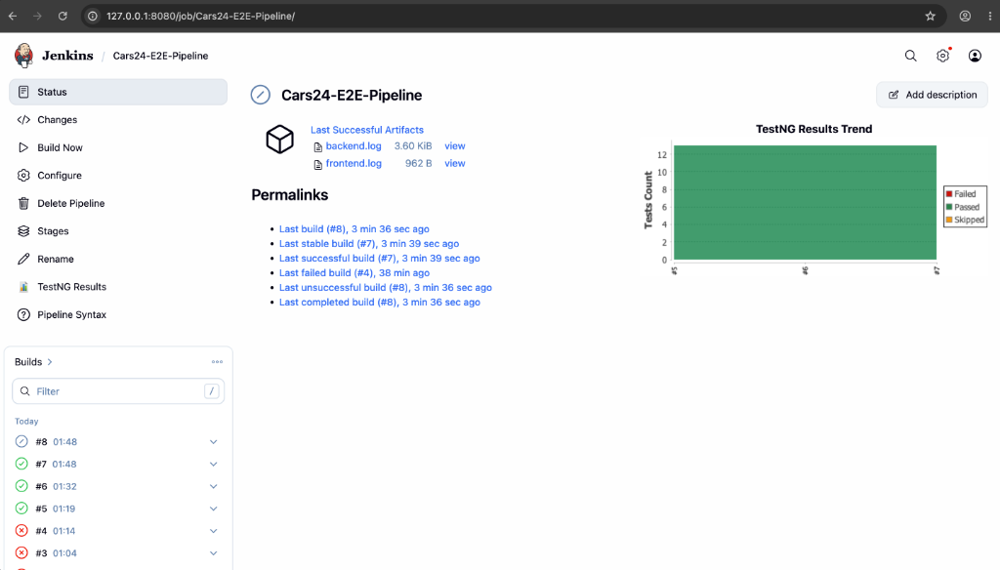
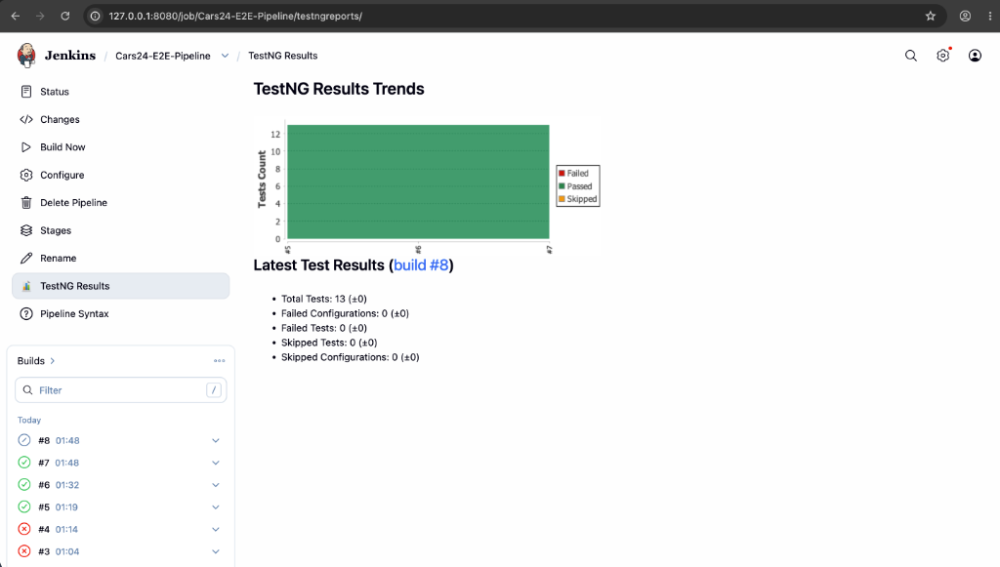
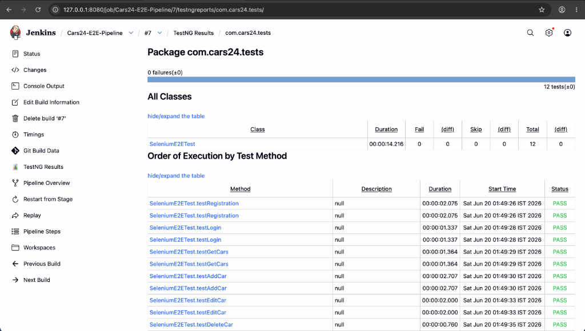
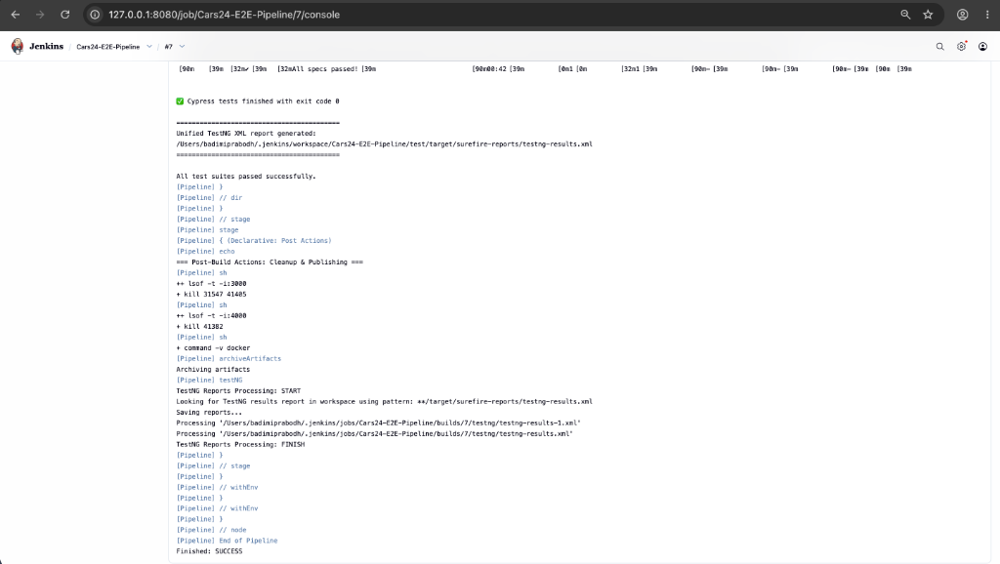
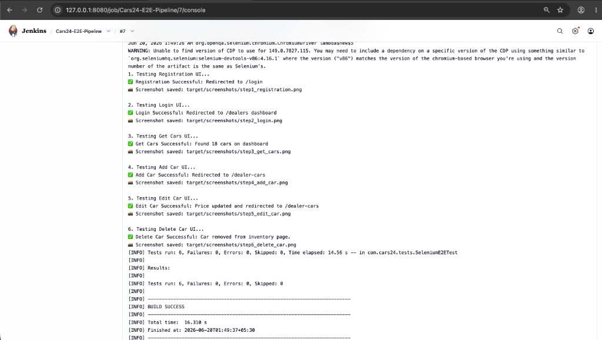

# CARS_24

This project is a MERN-based product management system clone for **CARS_24** with a React frontend, an Express/MongoDB backend, Selenium UI automation, Cypress end-to-end tests, and a JMeter HTTP test plan.

---

## 3. Project Structure

```text
CARS_24/
├── Backend/                 # Express/NodeJS backend and API endpoints
├── frontend/                # React/Vite frontend source code
├── test/                    # QA/Testing directory
│   ├── selenium-java/       # Selenium UI automation tests (TestNG/Maven)
│   ├── cypress/             # Cypress E2E browser tests
│   └── jmeter/              # JMeter functional/load testing scripts
├── docs/
│   └── screenshots/         # Screenshots of execution and Jenkins dashboard
├── Jenkinsfile              # Jenkins CI/CD pipeline script
└── README.md                # Project documentation
```

---

## 4. Features

- MERN-based Car Sales & Inventory Management system
- React frontend with routing and responsive UI layouts
- Express/Mongoose backend with MongoDB connectivity
- Integrated testing suites:
  - **Selenium** for browser-based UI automation
  - **Cypress** for end-to-end user flows
  - **JMeter** for functional and API-level load testing
- Continuous Integration pipeline configured via **Jenkins** with TestNG reporting

---

## 5. Prerequisites

Before running the application, make sure you have the following installed:
- **Node.js** (v18+)
- **MongoDB** (running locally or in Docker on port `27017`)
- **Java JDK** (v17+) and **Apache Maven** (for Selenium tests)
- **Apache JMeter** (for load testing)

---

## 6. Environment Variables

Backend reads MongoDB connection settings from environment variables.

Create a backend `.env` file at `Backend/.env` with:

```env
PORT=4000
MONGO_URL=mongodb://127.0.0.1:27017/cars24_clone
SECRET_KEY=attryb_cars24_jwt_secret_key_8x9y2z4w5v3u
```

*Note: If `MONGO_URL` is not set, the backend falls back to `mongodb://localhost:27017/cars24_clone`.*

### Developer Details
- **Lead Developer:** Prabodh Badimi
- **GitHub profile:** [prabodh2](https://github.com/prabodh2)
- **Repository:** [STQA_Major_Project](https://github.com/prabodh2/STQA_Major_Project)

---

## 7. How to Run

### 1. Start MongoDB
Make sure MongoDB is running locally before starting the backend.

### 2. Run the Backend
```bash
cd Backend
npm install
npm run dev
```
The backend starts on `http://localhost:4000` by default.

**Verify backend status:**
```http
GET http://localhost:4000/user
```

### 3. Run the Frontend
```bash
cd frontend
npm install
npm run start
```
The frontend runs on `http://localhost:3000` with React.

---

## Backend API Endpoints

**Base URL:** `http://localhost:4000`

| Method | Endpoint | Description |
| :--- | :--- | :--- |
| **POST** | `/user/register` | Register new user or dealer |
| **POST** | `/user/login` | Login user |
| **POST** | `/user/dealer-login` | Login dealer |
| **GET** | `/cars/public/cars` | Get all public cars catalog |
| **GET** | `/cars/single-car/:id` | Get details of a single car |
| **GET** | `/cars/dealer-cars` | Get inventory of the logged-in dealer |
| **POST** | `/cars/add-car` | Add a new car to inventory |
| **PATCH** | `/cars/edit-car/:id` | Edit details of an inventory car |
| **DELETE** | `/cars/delete-car/:id` | Delete a car from inventory |
| **GET** | `/oem/specs` | Get all OEM specifications |
| **POST** | `/oem/post-specs` | Add new OEM specifications |

**Example car creation payload:**
```json
{
  "title": "Honda City 2021",
  "description": "A beautiful sedan in pristine condition.",
  "image": "https://images.unsplash.com/photo-1555215695-3004980ad54e?auto=format&fit=crop&q=80&w=2070",
  "price": 3100000,
  "kmOnOdometer": 12000,
  "majorScratches": "None",
  "accidentsReported": 0,
  "previousBuyers": 1,
  "registrationPlace": "Mumbai",
  "originalPaint": "Yes"
}
```

---

## Frontend Routes

| Route | Page |
| :--- | :--- |
| `/` | Home / landing page |
| `/login` | User login page |
| `/register` | User/dealer registration page |
| `/dealer-login` | Dealer login page |
| `/dealers` | Dealer dashboard (OEM specs & inventory) |
| `/users-car` | Public cars inventory list |
| `/car/:id` | View single car details |
| `/add-car` | Add new car to inventory |
| `/dealer-cars` | View dealer's cars inventory |
| `/edit-car/:id` | Edit car details |

---

## Selenium Tests

Selenium tests live under `test/selenium-java` and are driven by TestNG.

**Main test suite class:**
```text
com.cars24.tests.SeleniumE2ETest
```

The suite runs these tests in order:
1. User registration (`testRegistration`)
2. Dealer login (`testLogin`)
3. Get Cars dashboard catalog (`testGetCars`)
4. Add car to inventory (`testAddCar`)
5. Edit car details (`testEditCar`)
6. Delete car (`testDeleteCar`)

**Run Selenium tests:**
```bash
cd test/selenium-java
mvn test
```

---

## Cypress Tests

The Cypress project is under `test/cypress` and is configured to use:
- **baseUrl:** `http://localhost:3000`
- **spec pattern:** `cypress/e2e/**/*.cy.js`

**Test files:**
- `all_6_apis.cy.js` (E2E master scenario test containing registration, login, get catalog, add, edit, and delete car)

**Run Cypress from the Cypress project folder:**
```bash
npx cypress open --config-file test/cypress/cypress.config.js
```
or run headless:
```bash
npx cypress run --config-file test/cypress/cypress.config.js
```

*The Cypress suite is also wired into Jenkins in the same style as the Selenium tests.*

---

## JMeter Test Plan

The JMeter HTTP test plan is located at:
```text
test/jmeter/all_6_apis.jmx
```

It covers:
- User registration request
- Dealer login request
- Add car request
- Edit car request
- Delete car request
- Get public cars request

*Open the `.jmx` file in JMeter and run it against the backend on `http://localhost:4000`.*

---

## Typical Development Flow

1. Start MongoDB.
2. Start the backend.
3. Start the frontend.
4. Open the app in the browser at `http://localhost:3000`.
5. Run Selenium, Cypress, or JMeter tests from their respective folders as needed.

---

## Notes

- The backend uses Express and Mongoose.
- The frontend uses React Router for navigation.
- Car detail pages, update pages, and dealer dashboard pages are all routed in the frontend.
- Cypress and Selenium are both used for browser-based verification.
- JMeter is included for API-level load and functional testing.

---

## Jenkins Execution Screenshots

### 1. Jenkins Build Dashboard


### 2. TestNG Results Trend


### 3. TestNG Executed Test Methods Status


### 4. Cypress Execution Console Output


### 5. Selenium Execution Console Output

